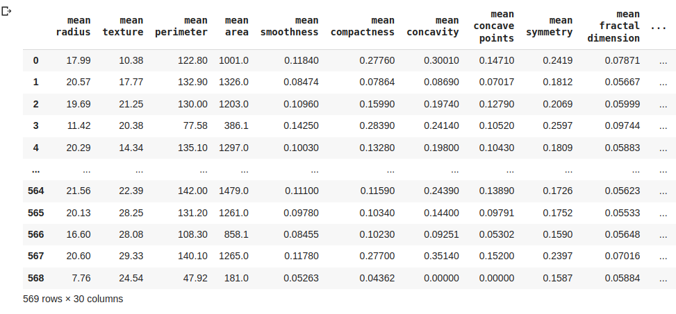
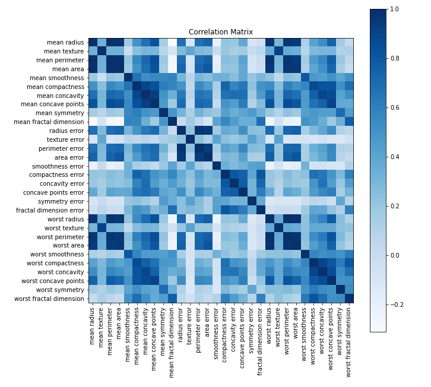

<h1 align="center">Breast-Cancer-Prediction-Using-SVM</h1> 
<h1 align="center">Python | Pandas | Matplotlib | Seaborn | Machine Learning | Support Vector  Machine</h1>


  ## Classification of Breast Cancer using ML 
  By using a best fit Machine Learning Algorithmic model (Support Vector Machine) to classify where the patient is classified with one of Cancer or not ,
  - Benign   --> for not a Cancer , denoted by  "1"
  - Malignant --> as a Cancer , denoted by  "0"


## Deployment

Depending Libraries

```bash
  import sklearn
  import numpy as np
  import pandas as pd
  import matplotlib.pyplot as plt
  import seaborn as sns
  from sklearn.model_selection import train_test_split
  from sklearn import datasets
  from sklearn.svm import SVC
  from sklearn.metrics import accuracy_score, precision_score, recall_score, f1_score, roc_auc_score
  from sklearn.model_selection import GridSearchCV
```

## Loading Data-set

Load the breast cancer Dataset from sklearn!

See `from sklearn import datasets` this has n number of data's.

From there importing data `datasets.load_breast_cancer()`.


## Having look at Data-set



## Exploratory Data Analysis
- Understanding the data using pandas "describe" , "info" methods
- Let's do the required data cleaning process like droping or filling null values
-  create a analytical study using matplotlib visualization 
-  create a co-relation metrics toward each data features 
-  Getting the important features from the data's




## Train - Test - Split

To run tests, run the following command

It is essential for an machine learning model to go for test data before training the original data to  avoid overfitting and better accuracy

```bash
  X_train, X_test, y_train, y_test = train_test_split(X, y, test_size=0.20, random_state=1)
```
## Getting the prediction with Test - Data

```bash
Fitting Train data
  classifier = SVC(kernel='rbf', C=1, gamma='scale', random_state=12)
  classifier.fit(X_train, y_train)
  
Make predicttions on train data
  y_pred = classifier.predict(X_test)
  
Getting accuracy score and other metric scores
  accuracy = accuracy_score(y_test, y_pred)
  precision = precision_score(y_test, y_pred)
  recall = recall_score(y_test, y_pred)
  f1 = f1_score(y_test, y_pred)
  auc_roc = roc_auc_score(y_test, y_pred)
```
## Conclusion 
Thus, having a better prediction we can use grid search to get the bet fit parameters too.
hence the algorithm gets a better understanding towards our loaded data
